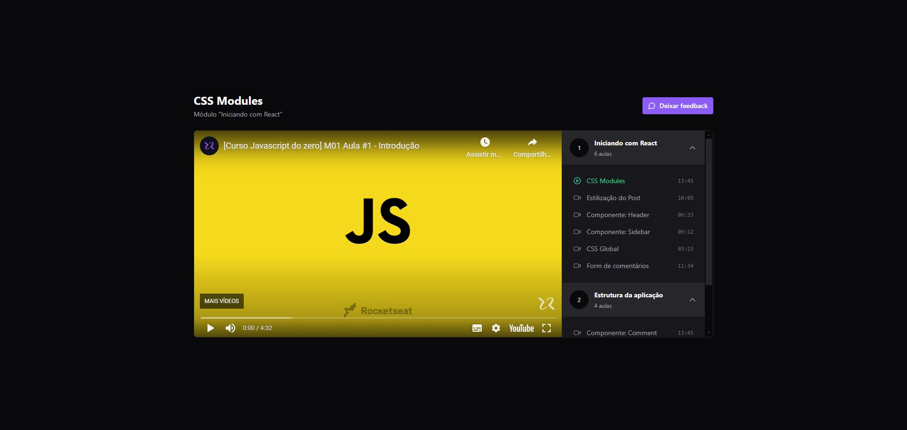

# About this project

A simple video player using Redux Toolkit. The project also includes examples of tests.



## Running instructions

```bash
# install dependencies
npm i

# run mocked server
npm run server

# run dev
npm run dev
```

You can check out [here](https://github.com/EricDosReis/react-zustand) a mirror project that uses Zustand instead of Redux.
